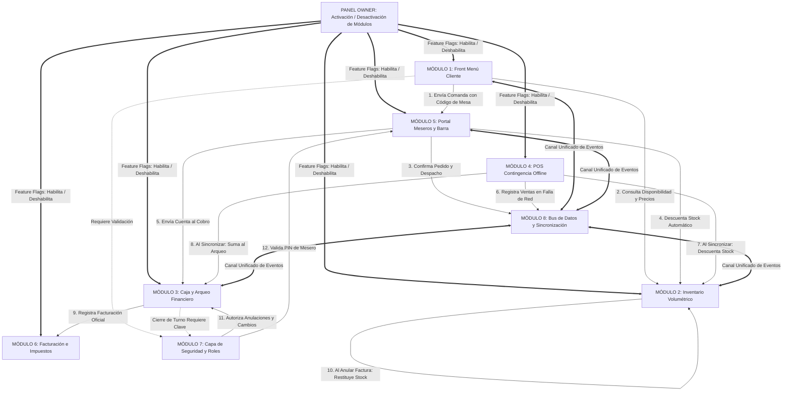

# 🍸 ESPECIFICACIÓN ARQUITECTÓNICA MODULAR: SISTEMA OPERATIVO PARA BARES Y DISCOTECAS
## Marco de Conectores, Mecánicas Operativas, Control Modular (Panel Owner) y Código Canónico de Referencia

---

### 🎯 PROPÓSITO DEL FRAMEWORK
Este documento es una **especificación técnica integral, mapa de conectores y manual de mecánicas operativas**. Define **qué secciones componen un sistema completo para el nicho de vida nocturna**, **cómo funciona en detalle la mecánica de cada proceso**, **cómo se conectan entre sí**, **cómo se activan o desactivan dinámicamente desde el Panel Owner**, y **cuál es el código estructurado exacto** que cualquier Agente de IA debe implementar para replicar esta lógica en cualquier nuevo bar, gastrobar o discoteca sin depender de nombres o estilos predefinidos.

---

## 🗺️ 1. MAPA GENERAL DE CONECTORES Y FLUJO DE DATOS



---

## ⚙️ 2. EXPLICACIÓN DETALLADA DE CADA MECÁNICA OPERATIVA

En esta sección se detalla el funcionamiento paso a paso de cada proceso clave del negocio:

---

### 🔄 MECÁNICA A: Ciclo de Vida del Pedido y Despacho de Comanda
```text
[Cliente en Mesa] ──(1)──> [Código de Mesa] ──(2)──> [Comanda KDS Barra/Cocina] ──(3)──> [Deducción Stock] ──(4)──> [Cobro en Caja]
```
1. **Selección del Pedido**: El cliente (o el mesero en la app de staff) selecciona los productos, elige variantes (ej. botella o shot individual), ajusta cantidades y escribe notas de preparación (ej. "sin azúcar", "hielo aparte").
2. **Validación de Presencialidad**: Antes de enviar, el sistema exige ingresar el **Código de Seguridad de la Mesa Física**. Si el código no coincide con el configurado para esa mesa, el pedido se bloquea impidiendo órdenes malintencionadas desde fuera del local.
3. **Recepción en Estación de Barra / Cocina (KDS)**: La comanda ingresa al portal de meseros en estado `Pendiente` y suena una alerta auditiva. Un cronómetro interno comienza a medir los minutos de espera (Verde: < 5 min, Amarillo: 5-10 min, Rojo: demorado).
4. **Preparación y Despacho**: El bartender/cocinero presiona `En Preparación` y luego `Listo para Entrega`. En este momento, el motor de inventario ejecuta la **deducción automática de stock**.
5. **Entrega y Cobro**: El mesero entrega en la mesa y marca `Entregado`. La cuenta pasa al módulo de caja para ser liquidada en efectivo o digital (`Pagado`).

---

### 🧪 MECÁNICA B: Descorche Volumétrico y Deducción de Licores por Mililitros
En un bar/discoteca, las botellas de licor de alto valor (aguardiente, ron, whisky, tequila, vodka, ginebra) se venden enteras o fraccionadas en tragos/shots (de 40ml a 50ml) y cócteles.

```text
                                  ┌── ¿Hay suficientes ml abiertos? ──> SÍ ──> Resta ml de openBottleVolumeMl
[Venta de 1 Shot / Trago de X ml] ─┤
                                  └── NO ──> Abre 1 Botella (currentStockUnits - 1) ──> Suma 750ml ──> Resta ml
```

* **Escenario 1 (Consumo de Botella Entera)**:
  * Si se vende 1 botella: Se resta `currentStockUnits = currentStockUnits - 1`.
* **Escenario 2 (Consumo de Tragos / Shots individuales)**:
  * Cada artículo fraccionable tiene definido su tamaño total de botella (`bottleTotalVolumeMl`, ej. 750ml), la porción estándar de trago (`shotServingVolumeMl`, ej. 45ml) y los mililitros disponibles en la botella actualmente abierta (`openBottleVolumeMl`).
  * Si se piden $N$ tragos, se calculan los mililitros necesarios: $\text{mlRequeridos} = N \times 45\text{ ml}$.
  * **Caso A (Alcanzan los ml en la botella descorchada)**:
    $$\text{openBottleVolumeMl} = \text{openBottleVolumeMl} - \text{mlRequeridos}$$
  * **Caso B (No alcanzan los ml)**:
    1. Se verifica si hay botellas cerradas disponibles (`currentStockUnits > 0`).
    2. Se abre una botella nueva: `currentStockUnits = currentStockUnits - 1`.
    3. Se transfieren sus 750ml a la botella descorchada:
       $$\text{openBottleVolumeMl} = (\text{openBottleVolumeMl} + 750) - \text{mlRequeridos}$$
  * **Caso C (Agotado total)**: Si no quedan ml ni botellas cerradas, el sistema marca el producto automáticamente como `Agotado` en el menú del cliente.

---

### 🔥 MECÁNICA C: Promociones Dinámicas y Cálculo en Tiempo Real
* **Anclaje al Navbar**: El banner de promoción se fija en la parte superior del menú móvil y de escritorio con el porcentaje de rebaja o tipo de oferta (ej. "¡20% OFF en toda la carta hoy!").
* **Cálculo Dinámico**: Los precios tachados o ajustados **no se queman de forma estática en el código**. La función de renderizado evalúa la promoción global activa y calcula:
  $$\text{Precio Cobrado} = \text{Precio Base} \times \left(1 - \frac{\text{Porcentaje Descuento}}{100}\right)$$
* Al agregar al carrito, el subtotal y el resumen reflejan el ahorro exacto sin inconsistencias entre la carta y la cuenta final.

---

### 🔌 MECÁNICA D: Facturación Offline de Contingencia y Sincronización
* **Independencia Total**: El cajero abre el archivo `OfflinePOS.html` directamente desde el Escritorio de la computadora de caja.
* **Carga de Catálogo en Vivo**: El HTML lee el inventario guardado en el navegador (`localStorage.getItem('app_admin_inventory')`) para tener siempre los nombres y precios reales.
* **Emisión de Recibos en Falla de Red**: El cajero busca productos en tiempo real, ingresa el número del talonario físico de papel (ej. `TAL-104`), el vendedor y el medio de pago.
* **Almacenamiento en Cola Local**: La factura se guarda en la clave `app_admin_contingency_invoices` con estado `ACTIVE`.
* **Sincronización con un Clic**: Al regresar internet o volver a la app central, el botón "Sincronizar" emite un evento `CustomEvent('app_store_update')`. El dashboard central lee las nuevas facturas, las deduplica por su ID (`cont-...`) y **descuenta de golpe el inventario y suma los ingresos a la caja del día**.

---

### 🚫 MECÁNICA E: Anulación de Facturas con Clave Maestra y Restitución de Stock
Si un cajero ingresa una factura offline por duplicado o con productos equivocados:
1. El Administrador ingresa al modal *Informe de Facturas de Contingencia* en el Dashboard.
2. Cada factura activa presenta el botón **"🚫 Anular Factura"**.
3. Al pulsarlo, se despliega un submodal de seguridad que exige la **Contraseña Maestra de Administrador** y el motivo de cancelación.
4. **Reversión Automática**:
   * La factura pasa a estado `VOIDED` y se muestra visualmente tachada con badge rojo.
   * El valor monetario de la factura se resta automáticamente del total acumulado de caja.
   * **El motor de inventario recorre los ítems de la factura y suma de vuelta las unidades cerradas o mililitros exactos al stock de bodega**.

---

### 💵 MECÁNICA F: Arqueo Diario de Caja y Control de Egresos
1. **Apertura de Jornada**: El cajero inicia el turno registrando la **Base Inicial en Efectivo** (monedas y billetes sencillos para cambio).
2. **Discriminación de Canales de Pago**: Cada orden o factura suma a su respectiva canasta:
   * Canasta A: Efectivo físico.
   * Canasta B: Datáfono / Tarjetas de crédito/débito.
   * Canasta C: Transferencias digitales por QR (Bancolombia, Nequi, etc.).
   * Canasta D: Pasarelas online integradas.
3. **Registro de Egresos Menores**: Pagos de emergencia salidos de la caja física (hielo, taxis, insumos rápidos).
4. **Cierre de Caja**:
   $$\text{Efectivo Físico Esperado} = \text{Base Inicial} + \text{Total Ventas Efectivo} - \text{Total Egresos Registrados}$$
   * El cajero cuenta el dinero físico real y el sistema calcula la discrepancia:
     $$\text{Discrepancia} = \text{Efectivo Real Contado} - \text{Efectivo Esperado} \quad (\text{Sobrante } > 0 \text{ o Faltante } < 0)$$

---

## 🎛️ 3. SISTEMA DE ACTIVACIÓN / DESACTIVACIÓN MODULAR (PANEL OWNER)

Para que esta plantilla se adapte a cualquier cliente (ej. un bar que solo atiende en barra y no usa meseros, o un club que no requiere reservas ni facturación electrónica), cada sección del sistema está gobernada por un **Feature Flagging Engine**.

---

### 3.1. Esquema de Datos Canónico de Módulos (`MODULE_FLAGS`)
```typescript
interface SystemModuleFlags {
  // Módulos Principales de Operación
  menu_client: boolean;          // Menú digital público para clientes
  table_orders: boolean;         // Envío de pedidos desde la mesa con código QR
  waiter_app: boolean;           // Portal de comandas y despacho para meseros
  volumetric_inventory: boolean; // Control de botellas, mililitros y mermas
  cash_register: boolean;        // Arqueo de caja, egresos y cuadre diario
  offline_contingency: boolean;  // Terminal POS offline de emergencia en /public
  electronic_invoicing: boolean; // Facturación electrónica y reportes DIAN
  reservations: boolean;         // Módulo de reservas de mesas y palcos VIP
  
  // Submódulos y Experiencia Visual
  atmosphere_scenes: boolean;    // Selector de escenas (Cócteles, Rumba, Natura)
  promo_banner: boolean;         // Banner superior de promociones sticky
  social_floating_btn: boolean;  // Botón flotante dinámico de redes sociales
  sound_effects: boolean;        // Efectos sonoros sintetizados en botones
}
```

---

### 3.2. Comportamiento del Sistema según Estado del Módulo
| Módulo Desactivado | Comportamiento en la Aplicación |
| :--- | :--- |
| `table_orders = false` | El menú cliente funciona en **Modo Catálogo Digital** (los botones "Agregar al Carrito" y "Pedir" se ocultan limpiamente). |
| `waiter_app = false` | La ruta `/waiter` queda bloqueada y el enlace en el footer o navbar se oculta. |
| `reservations = false` | Se oculta el botón "Reservar Mesa" en el navbar y hero section. |
| `electronic_invoicing = false` | La pestaña de facturación electrónica DIAN se oculta del panel de administración. |
| `offline_contingency = false` | Se deshabilita la exportación y el reporte de contingencia en el dashboard. |
| `volumetric_inventory = false` | El inventario opera en modo unitario simple (sin cálculo de ml por trago). |

---

### 3.3. Código Canónico del Gestor de Módulos (`moduleManager.js`)

```javascript
// Clave central en LocalStorage
export const MODULES_STORAGE_KEY = 'app_system_modules';

// Configuración por defecto (Todos encendidos)
export const DEFAULT_MODULES = {
  menu_client: true,
  table_orders: true,
  waiter_app: true,
  volumetric_inventory: true,
  cash_register: true,
  offline_contingency: true,
  electronic_invoicing: true,
  reservations: true,
  atmosphere_scenes: true,
  promo_banner: true,
  social_floating_btn: true,
  sound_effects: true
};

// Obtener estado actual de módulos
export function getActiveModules() {
  try {
    const stored = localStorage.getItem(MODULES_STORAGE_KEY);
    return stored ? { ...DEFAULT_MODULES, ...JSON.parse(stored) } : DEFAULT_MODULES;
  } catch (e) {
    return DEFAULT_MODULES;
  }
}

// Actualizar módulos desde el Panel Owner
export function updateActiveModules(updatedFlags) {
  try {
    const current = getActiveModules();
    const merged = { ...current, ...updatedFlags };
    localStorage.setItem(MODULES_STORAGE_KEY, JSON.stringify(merged));
    
    // Notificar a toda la aplicación reactivamente
    window.dispatchEvent(new CustomEvent('app_store_update', { 
      detail: { type: 'MODULES_UPDATED', modules: merged } 
    }));

    return { success: true, modules: merged };
  } catch (e) {
    console.error('Error guardando módulos:', e);
    return { success: false, error: e.message };
  }
}

// Hook de verificación rápida para componentes
export function isModuleEnabled(moduleId) {
  const modules = getActiveModules();
  return modules[moduleId] !== false;
}
```

---

### 3.4. Componente de Configuración para el Panel Owner (`OwnerModuleToggles.jsx`)

```jsx
import React, { useState, useEffect } from 'react';
import { getActiveModules, updateActiveModules } from '../../services/moduleManager';

const MODULE_DEFINITIONS = [
  { id: 'menu_client', label: 'Menú Digital Cliente', desc: 'Permite a los clientes ver la carta online' },
  { id: 'table_orders', label: 'Pedidos desde Mesa / QR', desc: 'Permite a los clientes pedir directamente desde su mesa' },
  { id: 'waiter_app', label: 'Portal de Meseros / KDS', desc: 'App móvil táctil para despacho de comandas en barra' },
  { id: 'volumetric_inventory', label: 'Inventario Volumétrico (ml)', desc: 'Control de botellas, shots y mermas' },
  { id: 'cash_register', label: 'Arqueo de Caja y Finanzas', desc: 'Cuadre diario de turno, ingresos y egresos' },
  { id: 'offline_contingency', label: 'Terminal POS Contingencia', desc: 'Facturación offline standalone de emergencia' },
  { id: 'electronic_invoicing', label: 'Facturación Electrónica Fiscal', desc: 'Resoluciones, prefijos y reportes DIAN/Fiscales' },
  { id: 'reservations', label: 'Módulo de Reservas VIP', desc: 'Agenda de mesas y palcos para clientes' },
  { id: 'promo_banner', label: 'Banner Superior de Promos', desc: 'Anuncio sticky de descuentos y horas felices' },
  { id: 'atmosphere_scenes', label: 'Selector de Atmósferas', desc: 'Cambio visual de temas (Cócteles, Rumba, Lounge)' }
];

export function OwnerModuleToggles() {
  const [modules, setModules] = useState(getActiveModules());
  const [saveSuccess, setSaveSuccess] = useState(false);

  const handleToggle = (id) => {
    const updated = { ...modules, [id]: !modules[id] };
    setModules(updated);
    updateActiveModules(updated);
    setSaveSuccess(true);
    setTimeout(() => setSaveSuccess(false), 2500);
  };

  return (
    <div className="owner-panel-card">
      <div className="panel-header">
        <h2>🎛️ Activación y Desactivación de Módulos (Panel Owner)</h2>
        <p>Enciende o apaga funciones según el plan o necesidades del establecimiento.</p>
      </div>

      {saveSuccess && <div className="alert-success">✓ Configuración de módulos actualizada en vivo</div>}

      <div className="toggles-grid">
        {MODULE_DEFINITIONS.map(mod => (
          <div key={mod.id} className={`toggle-card ${modules[mod.id] ? 'active' : 'inactive'}`}>
            <div className="toggle-info">
              <h3>{mod.label}</h3>
              <p>{mod.desc}</p>
            </div>
            <label className="switch">
              <input 
                type="checkbox" 
                checked={Boolean(modules[mod.id])} 
                onChange={() => handleToggle(mod.id)} 
              />
              <span className="slider round"></span>
            </label>
          </div>
        ))}
      </div>
    </div>
  );
}
```

---

## 💻 4. CÓDIGO CANÓNICO DEL MOTOR DE ESTADO (`appStore.js`)

```javascript
// ==========================================
// 1. CLAVES CENTRALIZADAS DE ALMACENAMIENTO
// ==========================================
export const STORAGE_KEYS = {
  AUTH: 'app_admin_auth',
  MODULES: 'app_system_modules',
  ORDERS: 'app_admin_orders',
  CASH_REGISTER: 'app_admin_cash_register',
  INVENTORY: 'app_admin_inventory',
  INVENTORY_LOGS: 'app_admin_inventory_logs',
  CONTINGENCY_INVOICES: 'app_admin_contingency_invoices',
  WAITERS: 'app_admin_waiters',
  PROMOTION: 'app_admin_menu_promotion',
  TABLE_CODES: 'app_admin_table_codes'
};

// ==========================================
// 2. DISPARADOR DEL EVENTBUS REACTIVO
// ==========================================
export function notifyStoreUpdate(detail = {}) {
  try {
    window.dispatchEvent(new CustomEvent('app_store_update', { detail }));
  } catch (e) {
    console.error('Error emitiendo evento de tienda:', e);
  }
}

// ==========================================
// 3. MOTOR DE DEDUCCIÓN DE INVENTARIO
// ==========================================
export function deductItemsFromInventory(itemsToDeduct) {
  try {
    const rawInv = localStorage.getItem(STORAGE_KEYS.INVENTORY);
    if (!rawInv) return;
    const inventory = JSON.parse(rawInv);

    itemsToDeduct.forEach(item => {
      const target = inventory.find(inv => 
        inv.id === item.id || 
        inv.id === item.invId || 
        (item.id && inv.id === ('inv-' + item.id)) ||
        (inv.name && item.name && inv.name.toLowerCase() === item.name.toLowerCase())
      );

      if (!target) return;

      const qty = Number(item.quantity || 1);

      if (item.type === 'shot' || item.type === 'glass') {
        const servingMl = Number(target.shotServingVolumeMl || 45);
        const totalMlNeeded = servingMl * qty;
        let openMl = Number(target.openBottleVolumeMl || 0);

        if (openMl >= totalMlNeeded) {
          target.openBottleVolumeMl = Math.max(0, openMl - totalMlNeeded);
        } else {
          if (target.currentStockUnits > 0) {
            target.currentStockUnits -= 1;
            const bottleTotalMl = Number(target.bottleTotalVolumeMl || 750);
            target.openBottleVolumeMl = Math.max(0, (openMl + bottleTotalMl) - totalMlNeeded);
          } else {
            target.openBottleVolumeMl = 0;
          }
        }
      } else {
        target.currentStockUnits = Math.max(0, Number(target.currentStockUnits || 0) - qty);
      }
    });

    localStorage.setItem(STORAGE_KEYS.INVENTORY, JSON.stringify(inventory));
    notifyStoreUpdate({ type: 'INVENTORY_DEDUCTED' });
  } catch (error) {
    console.error('Error al descontar de inventario:', error);
  }
}

// ==========================================
// 4. MOTOR DE RESTITUCIÓN DE INVENTARIO
// ==========================================
export function restoreItemsToInventory(itemsToRestore) {
  try {
    const rawInv = localStorage.getItem(STORAGE_KEYS.INVENTORY);
    if (!rawInv) return;
    const inventory = JSON.parse(rawInv);

    itemsToRestore.forEach(item => {
      const target = inventory.find(inv => 
        inv.id === item.id || 
        inv.id === item.invId || 
        (item.id && inv.id === ('inv-' + item.id)) ||
        (inv.name && item.name && inv.name.toLowerCase() === item.name.toLowerCase())
      );

      if (!target) return;

      const qty = Number(item.quantity || 1);

      if (item.type === 'shot' || item.type === 'glass') {
        const servingMl = Number(target.shotServingVolumeMl || 45);
        const totalMlToRestore = servingMl * qty;
        const bottleTotalMl = Number(target.bottleTotalVolumeMl || 750);
        let newOpenMl = Number(target.openBottleVolumeMl || 0) + totalMlToRestore;

        while (newOpenMl >= bottleTotalMl) {
          target.currentStockUnits = Number(target.currentStockUnits || 0) + 1;
          newOpenMl -= bottleTotalMl;
        }
        target.openBottleVolumeMl = newOpenMl;
      } else {
        target.currentStockUnits = Number(target.currentStockUnits || 0) + qty;
      }
    });

    localStorage.setItem(STORAGE_KEYS.INVENTORY, JSON.stringify(inventory));
    notifyStoreUpdate({ type: 'INVENTORY_RESTORED' });
  } catch (error) {
    console.error('Error al restituir inventario:', error);
  }
}

// ==========================================
// 5. ANULACIÓN DE FACTURAS CON CLAVE ADMIN
// ==========================================
export function voidContingencyInvoice({ invoiceId, adminPassword, reason }) {
  const storedAuth = JSON.parse(localStorage.getItem(STORAGE_KEYS.AUTH) || '{}');
  const validPasswords = [storedAuth.password, '12345678', 'MasterAdmin2026@'];

  if (!validPasswords.includes(adminPassword)) {
    return { success: false, message: 'Contraseña de administrador incorrecta.' };
  }

  try {
    const rawInvoices = localStorage.getItem(STORAGE_KEYS.CONTINGENCY_INVOICES);
    if (!rawInvoices) return { success: false, message: 'No hay facturas registradas.' };
    
    let invoices = JSON.parse(rawInvoices);
    const invoiceIndex = invoices.findIndex(i => i.id === invoiceId);
    
    if (invoiceIndex === -1) return { success: false, message: 'Factura no encontrada.' };

    const invoice = invoices[invoiceIndex];
    if (invoice.status === 'VOIDED') return { success: false, message: 'Esta factura ya está anulada.' };

    invoice.status = 'VOIDED';
    invoice.voidedAt = new Date().toISOString();
    invoice.voidReason = reason || 'Anulación autorizada por administrador';

    if (Array.isArray(invoice.items) && invoice.items.length > 0) {
      restoreItemsToInventory(invoice.items);
    }

    localStorage.setItem(STORAGE_KEYS.CONTINGENCY_INVOICES, JSON.stringify(invoices));
    notifyStoreUpdate({ type: 'INVOICE_VOIDED', invoiceId });

    return { success: true, message: `Factura #${invoice.invoiceNumber || invoice.id} anulada y stock restituido.` };
  } catch (error) {
    console.error('Error al anular factura:', error);
    return { success: false, message: 'Error interno al procesar la anulación.' };
  }
}

// ==========================================
// 6. MOTOR DE ARQUEO Y CIERRE DE CAJA
// ==========================================
export function calculateCashRegisterMetrics() {
  try {
    const cashData = JSON.parse(localStorage.getItem(STORAGE_KEYS.CASH_REGISTER) || '{}');
    const contingencies = JSON.parse(localStorage.getItem(STORAGE_KEYS.CONTINGENCY_INVOICES) || '[]');
    const orders = JSON.parse(localStorage.getItem(STORAGE_KEYS.ORDERS) || '[]');

    const initialBase = Number(cashData.initialCashBase || 0);
    const expenses = Array.isArray(cashData.expenses) 
      ? cashData.expenses.reduce((acc, exp) => acc + Number(exp.amount || 0), 0) 
      : 0;

    const activeContingencies = contingencies.filter(c => c.status !== 'VOIDED');
    const contingencyTotal = activeContingencies.reduce((acc, c) => acc + Number(c.total || 0), 0);

    const paidOrders = orders.filter(o => o.status === 'paid' || o.status === 'delivered');
    const ordersTotal = paidOrders.reduce((acc, o) => acc + Number(o.total || 0), 0);

    const grossRevenue = contingencyTotal + ordersTotal;
    const expectedCashInHand = initialBase + grossRevenue - expenses;

    return {
      isOpen: Boolean(cashData.isOpen),
      initialBase,
      expenses,
      contingencyTotal,
      ordersTotal,
      grossRevenue,
      expectedCashInHand
    };
  } catch (e) {
    console.error('Error calculando caja:', e);
    return { initialBase: 0, expenses: 0, grossRevenue: 0, expectedCashInHand: 0 };
  }
}
```

---

## 📋 5. CHECKLIST DE ADAPTACIÓN PARA NUEVOS PROYECTOS

Cuando un Agente de IA reciba la tarea de crear un nuevo bar, gastrobar o discoteca, debe seguir estos 7 pasos:

```text
[ ] 1. DEFINICIÓN DE IDENTIDAD DE MARCA
    ├── Asignar Nombre, Logotipo y Paleta de Colores en :root (--bg, --accent, --glow)
    └── Ajustar tipografías display y monoespaciadas

[ ] 2. CONFIGURACIÓN DE FEATURE FLAGS (MÓDULOS)
    ├── Definir qué módulos necesita este negocio en DEFAULT_MODULES
    └── Vincular los toggles al Panel Owner

[ ] 3. CARGA DE CARTA Y MENÚ
    ├── Crear categorías comerciales (Licores, Cócteles, Cervezas, Sin Alcohol, Comida)
    └── Poblar artículos con intensidades alcohólicas (1-5), fotos y precios

[ ] 4. MODELADO DE INVENTARIO VOLUMÉTRICO
    ├── Definir botellas fraccionables con mililitros totales y ml por shot
    └── Definir cervezas, mixers y snacks por unidad cerrada

[ ] 5. CONFIGURACIÓN DE MESAS Y SEGURIDAD
    ├── Generar lista de mesas/barras físicas y asignarles códigos de seguridad
    └── Configurar Contraseña Maestra de Administrador y PINs de Meseros

[ ] 6. DESPLIEGUE DEL TERMINAL OFFLINE EN /public
    ├── Sincronizar el catálogo en OfflinePOS.html para emergencias sin internet
    └── Probar exportación en JSON y copia al portapapeles

[ ] 7. VERIFICACIÓN DE FLUJO INTEGRAL
    ├── Prueba: Pedido en mesa ➔ Mesero acepta ➔ Inventario descuenta ml
    ├── Prueba: Cobro en caja ➔ Arqueo suma medio de pago correspondiente
    └── Prueba de Seguridad: Anular factura ➔ Exige clave admin ➔ Restituye stock
```

---
*Este documento constituye la especificación canónica y estructural para el desarrollo de sistemas en el nicho de Bares, Discotecas y Gastronomía Nocturna.*
